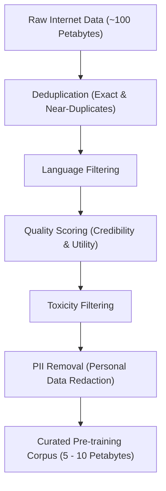
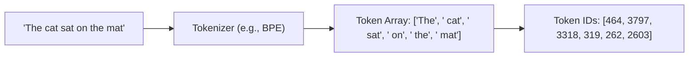
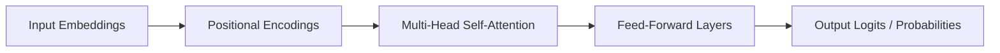
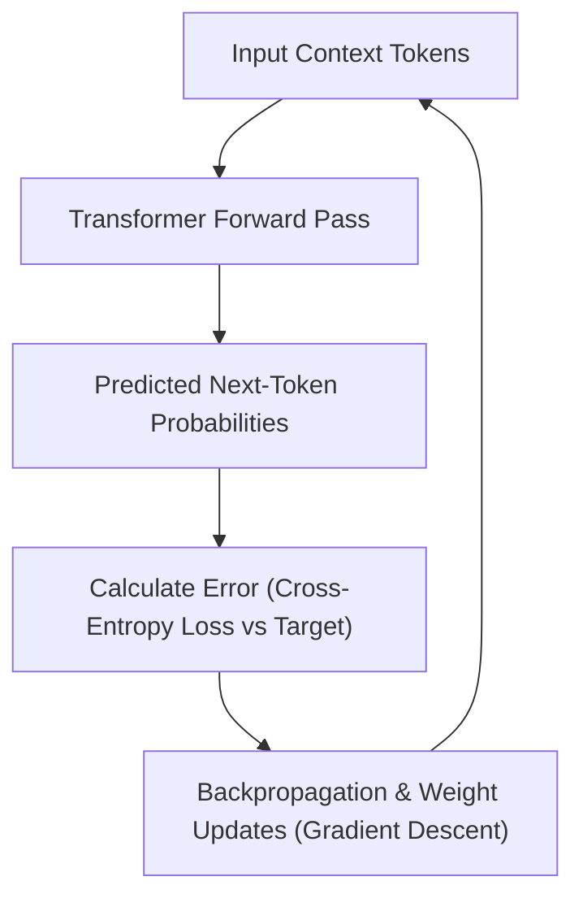

# Agentic AI Foundations

Welcome to **Agentic AI Foundations**! This repository is dedicated to exploring, designing, and building foundational architectures, patterns, and applications for autonomous AI agents.

---

## 📌 Overview & Core Concepts

Agentic AI represents a paradigm shift from passive model interaction to proactive, goal-driven AI systems capable of planning, using tools, executing complex workflows, and collaborating with human users.

- **Agent Architectures**: Memory systems, planning modules, reflection loops, and decision-making mechanisms.
- **Tool Use & Integrations**: Interfacing with APIs, CLI execution, web navigation, and specialized toolkits.
- **Multi-Agent Systems**: Task delegation, multi-agent coordination, and peer-to-peer workflows.
- **Safety & Alignment**: Guardrails, human-in-the-loop (HITL) validation, and execution monitoring.

---

## 🤖 What is an AI Agent?

An **AI Agent** transforms a standalone language model into an autonomous problem solver capable of executing complex goals ([mylearn.oracle](https://mylearn.oracle.com/ou/course/oracle-agentic-ai-foundations-2026/163240/271870)):

$$\text{AI Agent} = \text{LLM} + \text{Tools} + \text{Loop} + \text{Reasoning Patterns}$$

- **LLM**: The "brain" that reasons and decides what to do.
- **Tools**: Functions, APIs, databases, or services the agent can call.
- **Loop**: Repeated cycle of *"think $\rightarrow$ act $\rightarrow$ observe $\rightarrow$ think again"* until the goal is met.
- **Reasoning Patterns**: Strategies like planning, reflection, and multi-step workflows that guide how the agent uses the loop.

---

### 🔄 The Agent Execution Loop

The core dynamic of an AI agent is its continuous execution loop:


```
Perceive (Input/Observation) ──► Reason (Select Next Step) ──► Act (Call Tool/Respond) ──► Observe (Receive Result/Feedback) ──► (Repeat Loop)
```

---

### ⚡ Key Contrast: Chatbot vs. AI Agent

- **Chatbot**: $\text{Prompt} \longrightarrow \text{LLM} \longrightarrow \text{Single Answer}$
- **Agent**: $\text{Prompt} \longrightarrow \text{LLM} \longrightarrow \text{Choose Tool} \longrightarrow \text{Execute} \longrightarrow \text{Observe} \longrightarrow \text{LLM Again} \longrightarrow \text{More Tool Calls} \longrightarrow \text{Final Answer}$ ([mylearn.oracle](https://mylearn.oracle.com/ou/course/oracle-agentic-ai-foundations-2026/163240/271870))

#### Standalone LLM vs. (LLM-based) AI Agent


| Capability | Standalone LLM | AI Agent (LLM-based) |
| :--- | :--- | :--- |
| **Knowledge Access** | Training data + provided context (prompt); no built-in live access | Training + live tools (dynamic) |
| **Actions** | Generate text | Search, compute, call APIs, write code |
| **Memory** | None between calls | Working + persistent memory |
| **Planning** | Single-pass response | Multi-step planning & iteration |
| **Self-Correction** | Can do internal consistency checks; ext. verification requires tools or retrieval | Observes results, retries on error |
| **State** | No built-in persistent state (state is app-managed) | Maintains context across steps |

---

### 🚀 Why "Agentic" AI Matters

> *Moving from "AI that talks" to "AI that does."*

- **Automates Multi-Step Tasks**: Handles complex workflows autonomously instead of just answering questions.
- **Interacts with Real Systems**: Connects directly with databases, enterprise applications, and cloud services.
- **Enables Goal-Oriented Behavior**: Keeps working and iterating until a defined objective is fully achieved ([mylearn.oracle](https://mylearn.oracle.com/ou/course/oracle-agentic-ai-foundations-2026/163240/271870)).

---

## 🎓 Course Curriculum: Oracle Agentic AI Foundations

This repository aligns with and builds upon concepts from the [Oracle Agentic AI Foundations](https://mylearn.oracle.com/ou/course/oracle-agentic-ai-foundations-2026/163240/273946) course.

### 🎯 What You’ll Learn
The course covers AI-agent architecture, LLMs, tools, execution loops, reasoning patterns, safety guardrails, LangChain, the Model Context Protocol (MCP), and the OpenAI Responses API and Agents SDK. It then applies these topics to OCI Enterprise AI and Oracle AI Database ([mylearn.oracle](https://mylearn.oracle.com/ou/course/oracle-agentic-ai-foundations-2026/163240/273946)).

By the end, you should be able to design agents with LangChain and the OpenAI agent stack, incorporate MCP into workflows, build agents on OCI Enterprise AI Platform, and use Oracle AI Database capabilities for agentic solutions ([mylearn.oracle](https://mylearn.oracle.com/ou/course/oracle-agentic-ai-foundations-2026/163240/273946)).

---

### 📚 Course Structure

1. **Introduction to AI Agents**: Agent definitions, components, reasoning, a first-agent walkthrough, and guardrails ([mylearn.oracle](https://mylearn.oracle.com/ou/course/oracle-agentic-ai-foundations-2026/163240/273946)).
2. **LangChain for AI Agents**: LangChain basics, building an agent, demos, and internal agent behavior ([mylearn.oracle](https://mylearn.oracle.com/ou/course/oracle-agentic-ai-foundations-2026/163240/273946)).
3. **Introduction to MCP**: MCP concepts and components, connecting an MCP server to an agent, and practical server examples ([mylearn.oracle](https://mylearn.oracle.com/ou/course/oracle-agentic-ai-foundations-2026/163240/273946)).
4. **OpenAI Responses API and Agents SDK**: OpenAI agent stack, APIs, SDKs, tool/function calling, multi-agent handoffs, safety, and a customer-support-agent demo ([mylearn.oracle](https://mylearn.oracle.com/ou/course/oracle-agentic-ai-foundations-2026/163240/273946)).
5. **Agentic AI for OCI Enterprise AI**: Agent lifecycle and runtime, OCI Enterprise AI Platform and Agents, deployment, and scaling ([mylearn.oracle](https://mylearn.oracle.com/ou/course/oracle-agentic-ai-foundations-2026/163240/273946)).
6. **Agentic AI for Oracle AI Database**: Vector search, Private Agent Factory, and an Autonomous AI Database MCP server ([mylearn.oracle](https://mylearn.oracle.com/ou/course/oracle-agentic-ai-foundations-2026/163240/273946)).

---

## 🛠️ Getting Started

### Prerequisites

- Python 3.10+ / Node.js 18+
- API Credentials for target LLM providers

### Setup

```bash
# Clone the repository
git clone https://github.com/Tarunkommi/Agentic-AI-Foundations.git

# Navigate into the project directory
cd Agentic-AI-Foundations
```

---

## 📝 License

This project is open-source under the [MIT License](LICENSE).

---

## 🧠 How Large Language Models (LLMs) Are Built and Deployed

Understanding the foundation of Agentic AI requires understanding how Large Language Models (LLMs) are created, trained, and operated. 

An LLM is **not** a database that inherently understands facts; it is a statistical system trained to predict the most likely next token based on patterns learned from enormous datasets.


```
Data Collection ──► Cleaning & Filtering ──► Tokenization ──► Vector Embeddings ──► Transformer Neural Network ──► Next-Token Training ──► Supervised Fine-Tuning (SFT) ──► RLHF Alignment ──► Real-Time Inference
```

---

### 1. The Four Stages of LLM Development

The creation of a modern LLM can be understood through the analogy of raising and educating a child:

| Stage | Human Analogy | LLM Term | What It Achieves |
| :--- | :--- | :--- | :--- |
| **1** | Child absorbs books, media, and conversations | **Pre-training** | Learns broad language structure, coding patterns, and world knowledge. |
| **2** | Teacher demonstrates proper Q&A responses | **Supervised Fine-Tuning (SFT)** | Learns instruction-following, structured response formats, and assistant style. |
| **3** | Society gives feedback on behavior & safety | **RLHF (Human Feedback Alignment)** | Learns preferred, safer, polite, and helpful outputs. |
| **4** | Child answers a new question in real time | **Inference** | Generates responses token-by-token for end users in real time. |

Products such as **ChatGPT**, **Claude**, and **Gemini** expose these underlying trained models through user-facing chat interfaces and APIs.

---

### 2. Pre-training Data & Scale

Pre-training exposes the network to vast volumes of textual and source code data.

- **Data Sources**: Common Crawl web data, GitHub repositories, Wikipedia, digital books, academic papers, Reddit, forums, and Stack Overflow.
- **Scale of Data**:
  - **GPT-3**: ~300 Billion tokens
  - **Llama 3**: ~15 Trillion tokens
- **What is a Token?**: A token is a word fragment or character sequence. This scale allows models to process far more text during training than any human could read in multiple lifetimes.

---

### 3. Data Cleaning & The Filtering Funnel

Raw internet data contains duplicate content, broken code, spam, toxic content, and sensitive personal information. Data quality directly governs model safety and capability ("Garbage in, Garbage out").



*Example*: Data preprocessing funnels often shrink raw web dumps from **100 Petabytes** down to **5–10 Petabytes** of high-quality training text.

---

### 4. Tokens and Tokenization

Computers cannot process raw characters directly. A **tokenizer** parses text into smaller units (words, word fragments, or punctuation) and maps them to integer numerical IDs.



- **Byte Pair Encoding (BPE)**: A common algorithm that iteratively merges frequent character pairs to create an efficient vocabulary of subword units.
- **Language Efficiency**: Tokenization efficiency varies by language. For instance, a phrase in Telugu may tokenize into significantly more tokens than an equivalent English phrase, directly impacting context window usage and API execution costs.

---

### 5. Vector Embeddings

Numerical token IDs do not intrinsically convey semantic meaning. An **Embedding Layer** transforms each token ID into a high-dimensional vector of real numbers (e.g., 1,536 dimensions).

$$ \text{Text} \longrightarrow \text{Tokens} \longrightarrow \text{Token IDs} \longrightarrow \text{Embedding Vectors} $$

In this high-dimensional vector space, semantically related concepts reside close to one another:
- $\text{Vector}(\text{"king"}) \approx \text{Vector}(\text{"queen"})$
- $\text{Vector}(\text{"apple"}) \approx \text{Vector}(\text{"banana"})$

Embeddings make natural language mathematically operable for neural networks.

---

### 6. Transformer Neural Networks & Attention

Modern LLMs rely on the **Transformer** architecture introduced in Google's 2017 landmark paper, *"Attention Is All You Need"*. Transformers superseded older architectures like RNNs and LSTMs by eliminating sequential processing bottlenecks and enabling massive parallel training across long contexts.



#### Core Components:
1. **Positional Encodings**: Inject sequence order information so the model differentiates word meanings based on placement (e.g., *"river bank"* vs. *"went to the bank"*).
2. **Self-Attention Mechanism**: Computes contextual weights between all pairs of tokens in a sequence.
   - *Example*: In *"The cat sat on the mat because it was tired"*, self-attention calculates that **"it"** refers to **"cat"**.

---

### 7. The Training Loop

The fundamental pre-training objective is **Next-Token Prediction**. Given an input sequence, the model outputs a probability distribution over its vocabulary for what token comes next.



The network compresses complex statistical, grammatical, and factual relationships into its billions of parameter weights rather than storing a traditional explicit lookup database.

---

### 8. Compute Infrastructure & Training Costs

Training modern frontier models requires vast computing clusters running highly parallel operations:

- **Infrastructure**: Clusters containing tens of thousands of specialized GPUs (e.g., NVIDIA H100s/A100s).
- **Cost Allocation**: The majority of reported multi-million dollar model development costs (~$100 Million) is concentrated in the **Pre-training** phase.
- **Scale Illustration**: Running ~25,000 GPUs continuously over ~6 months incurs approximately $80 Million+ in pure hardware, energy, and facility expenses.

---

### 9. Supervised Fine-Tuning (SFT)

A raw pre-trained base model excels at continuing text, but may not act as a helpful conversational assistant (e.g., prompted with a question, it might append more questions instead of answering).

**Supervised Fine-Tuning (SFT)** uses curated dataset pairs of human-authored prompts and ideal responses to teach the model:
- Direct instruction following
- Conversational persona and tone
- Structured output formatting (JSON, Markdown, code blocks)
- Explanatory techniques (e.g., *"Explain like I'm 10"*)

---

### 10. RLHF & Safety Alignment

**Reinforcement Learning from Human Feedback (RLHF)** further aligns the model with human preferences and safety standards.

1. **Human Preference Ranking**: Annotators rate multiple candidate model outputs.
2. **Reward Model Training**: A separate model learns to score responses based on human preferences.
3. **Policy Optimization (PPO/DPO)**: The base LLM is fine-tuned to maximize scores from the reward model while maintaining factual integrity.
4. **Safety Refusals**: Rules and guardrails train the system to decline dangerous, illicit, or harmful requests gracefully.

---

### 11. Real-Time Inference

Inference occurs when an end user submits a prompt to an application or API.

```
Prompt Input ──► Context Encoding ──► Probability Distribution Calculation ──► Token Sampling ──► Append Token ──► Repeat Loop
```

- **Autoregressive Generation**: The model predicts and emits one token at a time, appending each newly generated token back into its context window for the next iteration. This creates the streaming text effect in user interfaces.
- **API Economics**: Computational load scales with both input context length and output generation length, which is why API providers bill separately for **Input Tokens** and **Output Tokens**.

---

### 12. Model Limitations & Mental Model

#### Key Limitations:
- **Hallucinations**: Generates statistically plausible text that may not be factually correct.
- **Knowledge Cutoff**: Information is static up to the date data collection ended.
- **Language Imbalance**: Models perform best in high-resource languages (e.g., English) compared to low-resource languages.
- **Sensitivity & Non-Determinism**: Minor prompt variations or sampling parameters (temperature, top-p) lead to different responses.

#### Practical Mental Model:
Think of an LLM as a high-dimensional probability engine estimating:

$$ P(\text{Next Token} \mid \text{Previous Tokens}) $$

It translates pre-training pattern recognition, refined through SFT and RLHF alignment, into fluent generation—balancing immense capabilities in reasoning and coding with inherent limitations in static fact recall.

---


